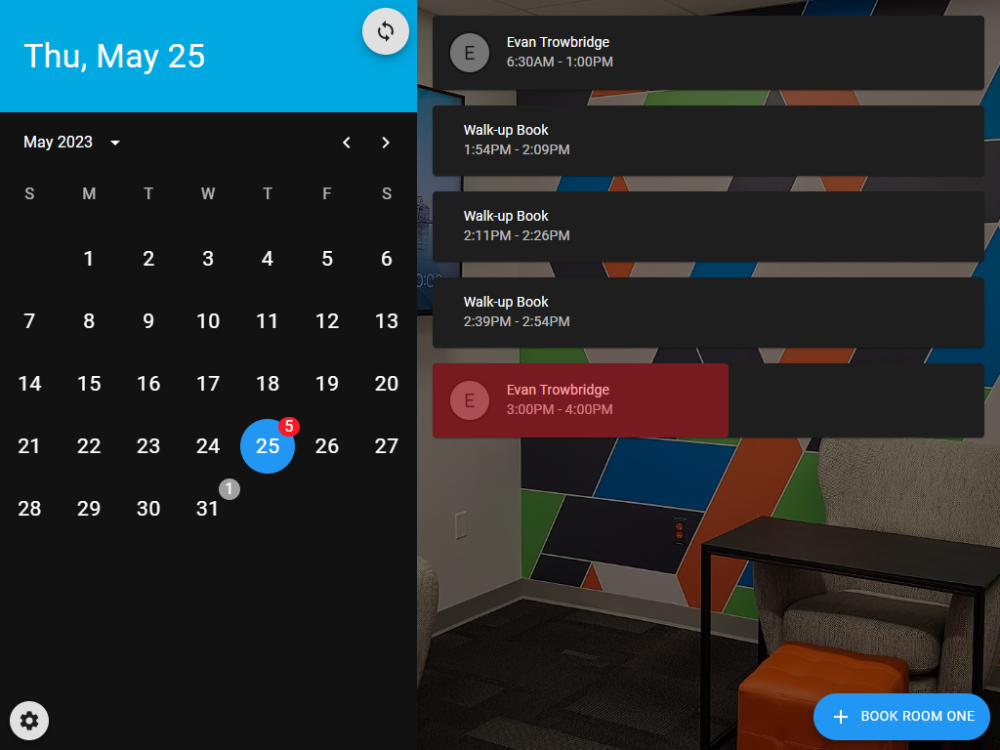
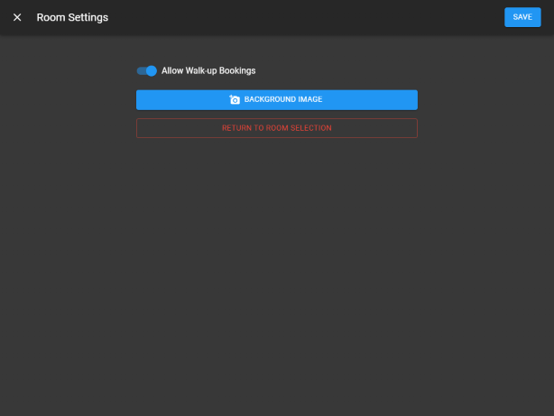
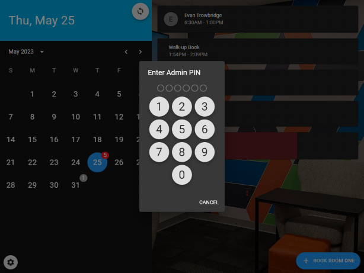
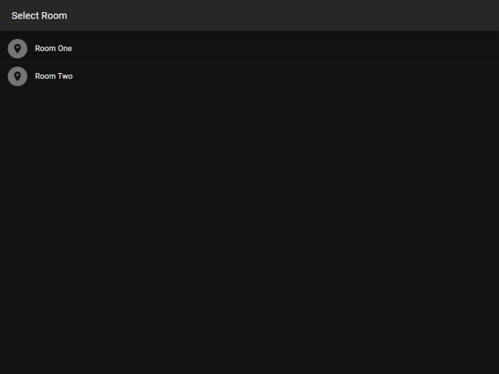

# room-scheduler

## Web UI:

-   See active and scheduled meetings
-   Book walk-up meetings



### Room Settings



### Room Settings Security



### Room Selection is Stored in cookies



# Development

## Requirements

-   [NodeJS](https://nodejs.org/en/download/)
-   [Python3](https://www.python.org/downloads/)

## Install NodeJS Dependencies

```shell
npm install
cd web-app && npm install && cd ..
```

# Run Dev Instance

```shell
npm run dev
```

# Docker

## Build Docker Image

Build web UI and create image locally

```shell
npm run build
docker build -t evantrow/room-scheduler .
```

## Publish Docker Image

Upload image to Github Docker Registry

```shell
docker push evantrow/room-scheduler:latest
```

## Deploy Image

```shell
docker run -d \
    -p 8080:8080 \
    -e AZURE_TENANT_ID=xxxxxxxx-xxxx-xxxx-xxxx-xxxxxxxxxxxx \
    -e AZURE_CLIENT_ID=xxxxxxxx-xxxx-xxxx-xxxx-xxxxxxxxxxxx \
    -e AZURE_CLIENT_SECRET=xxxxxxxxxxxxxxxxxxxxxxxxxxxxxxxxxxxxxxxx \
    -e AZURE_GROUP_ID=xxxxxxxx-xxxx-xxxx-xxxx-xxxxxxxxxxxx \
    -e ADMIN_PIN=123456 \
    --name=room-scheduler \
    evantrow/room-scheduler:latest
```

<br/>

### Environment Variables

| Variable            | What it do?                                            |
| ------------------- | ------------------------------------------------------ |
| AZURE_TENANT_ID     | Directory (tenant) ID                                  |
| AZURE_CLIENT_ID     | Azure Application (client) ID                          |
| AZURE_CLIENT_SECRET | Azure Application Client Secret                        |
| AZURE_GROUP_ID      | Azure Group ID for rooms to be available for selection |
| ADMIN_PIN           | Pin for accessing room setting within the web UI       |
